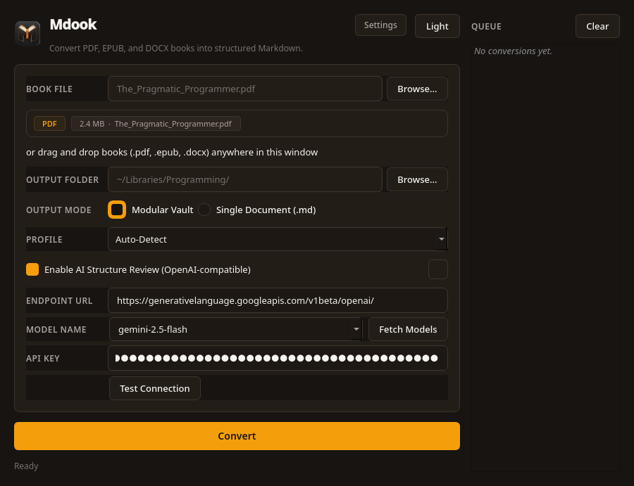
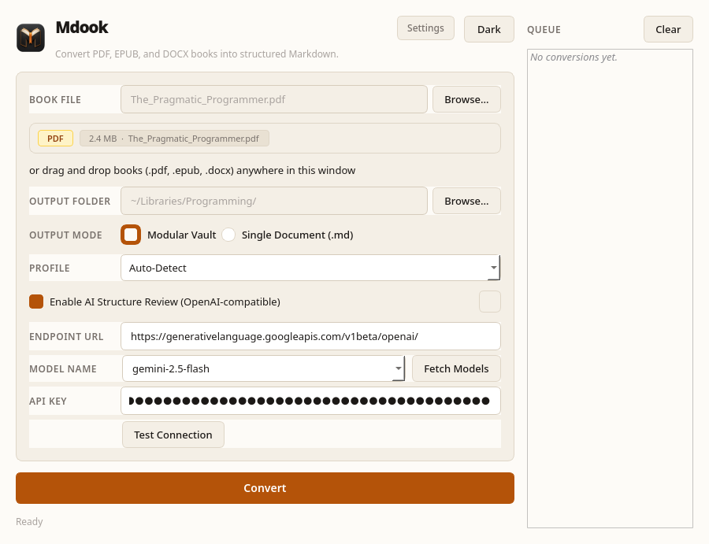
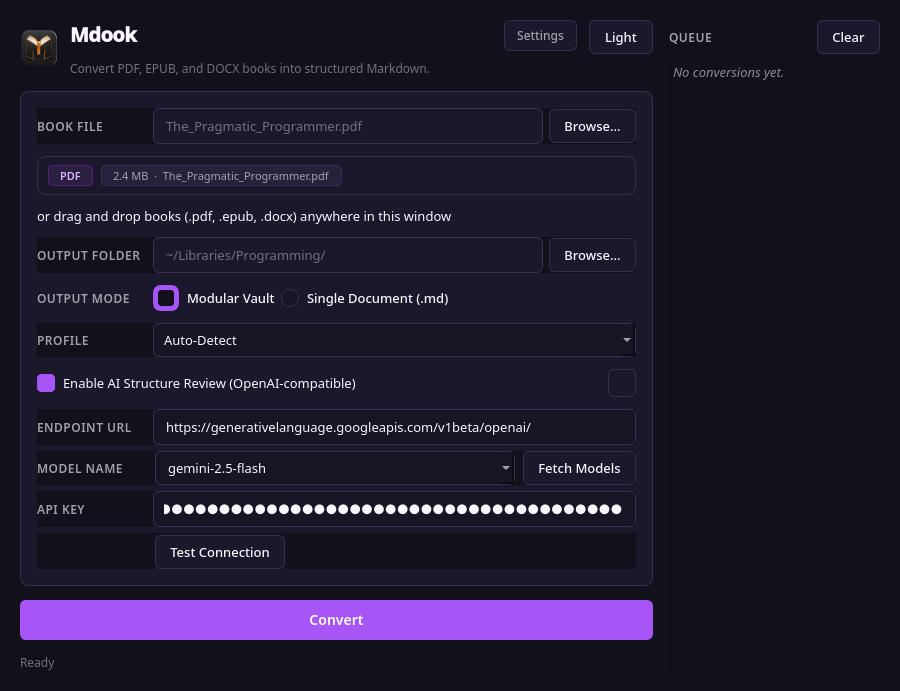
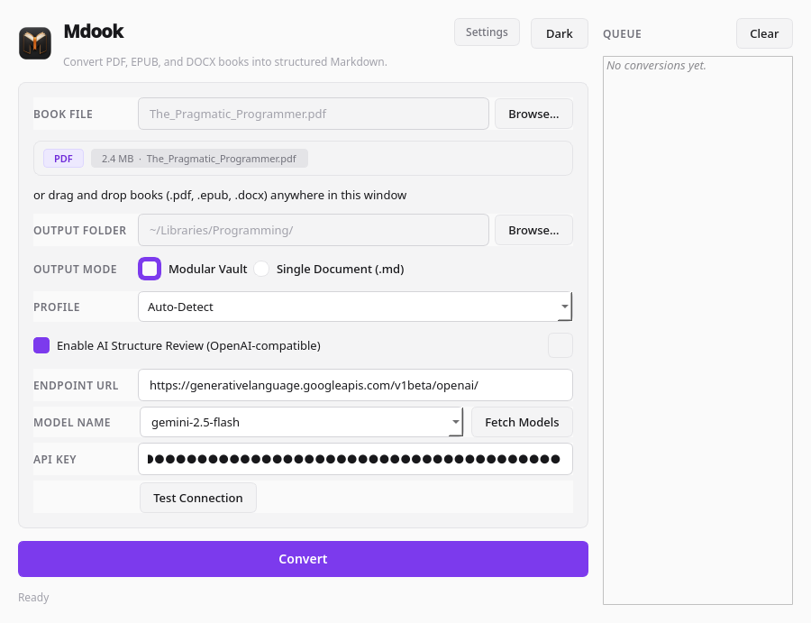
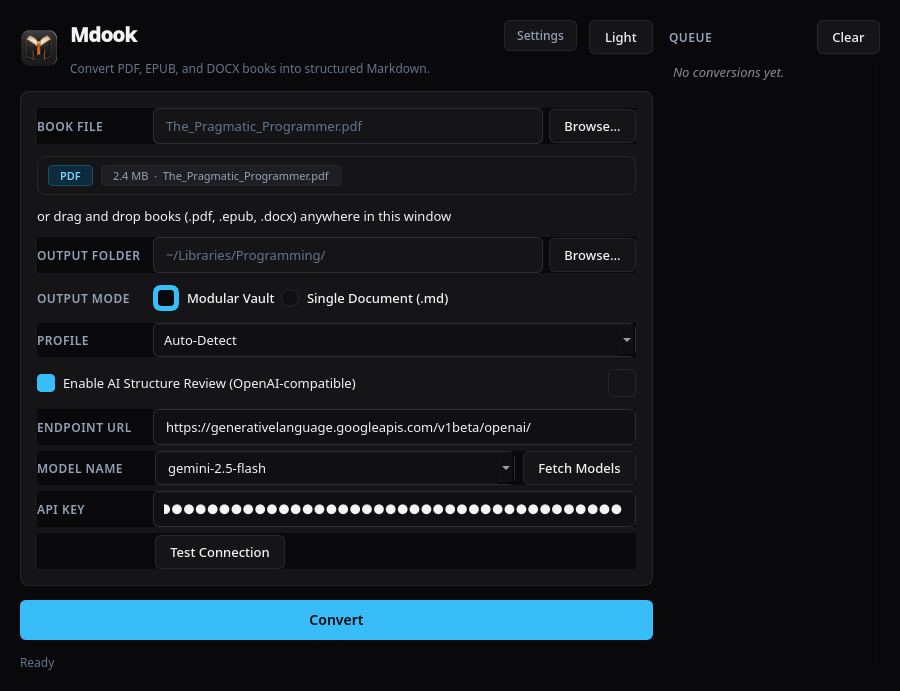
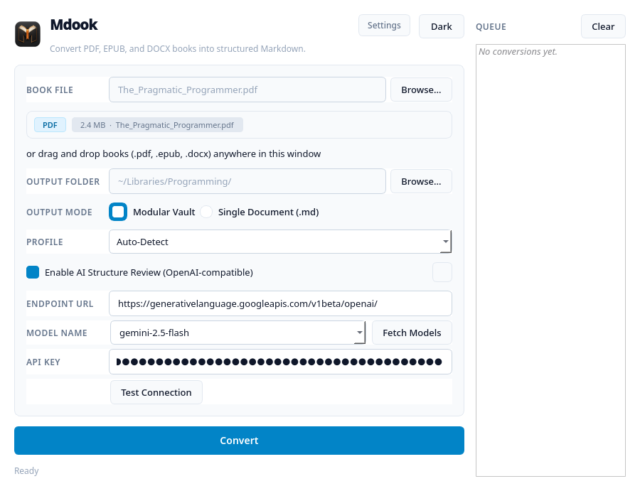
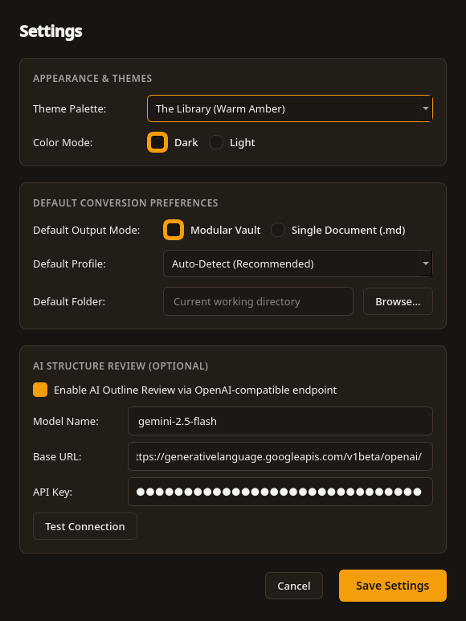

<div align="center">


# Mdook

**Transform books (PDF, EPUB, DOCX) into structured, interlinked Markdown libraries and reading documents.**

[](https://www.python.org/)
[](LICENSE)
[](https://pypi.org/project/PySide6/)
[](https://github.com/astral-sh/ruff)
[]()

</div>

---

## Overview

Most document-to-Markdown tools produce a single, messy text dump with broken paragraphs, leaked running headers, lost footnotes, and fractured tables.

**Mdook** is an application engineered specifically for **books**. It ingests PDF documents, EPUB3 publications, and Word (DOCX) manuscripts, analyzes typography and document structure through deterministic heuristics or native container markup, and generates either an **interlinked, chapter-split Markdown library** or a verbatim **Single Document** (`.md`) ready for reading and personal knowledge management.

```text
Input: Book (.pdf / .epub / .docx)
   │
   ├── [PDF Path] ──────────► [Stage 1: Intake] ──► [Stage 2: Extraction] ──► [Stage 3: Semantics]
   │                                                                               │
   ├── [EPUB3 Path] ────────► Direct XHTML & TOC Parsing into DocumentTree ────────┤
   │                                                                               │
   └── [DOCX Path] ─────────► Direct OpenXML & Styles Parsing into DocumentTree ───┤
                                                                                   ▼
                                                                       [Stage 4: Rendering]
                                                                       ┌───────────┴───────────┐
                                                                       ▼                       ▼
                                                                [Modular Library]      [Single Document]
                                                                       │                       │
                                                                       ▼                       ▼
                                                                  [Stage 5: Validation Audit]
                                                                       │                       │
                                                                       ▼                       ▼
                                                            /My-Book-Library/        /My-Book/
                                                            ├── Title - Index.md     ├── Title.md
                                                            ├── 00 - Front Matter.md └── attachments/
                                                            ├── 01 - Chapter 1.md
                                                            ├── Appendix.md
                                                            └── attachments/
```

---

## Key Features

### Deterministic Layout & Semantic Engine
- **Font-Clustering Heading Hierarchy**: Reconstructs book structure even when the PDF lacks bookmarks or a table of contents.
- **Part / Book / Volume Segmentation**: Recognizes multi-tier books and groups chapters under Part divisions in the library Index.
- **Front & Back Matter Isolation**: Automatically isolates Preface, Introduction, Notes, Bibliography, and Appendices into dedicated sections.
- **Multi-Column & Bidirectional Reading Order**: Column detection with right-to-left (RTL) reading order for Hebrew and Arabic scripts.

### Scanned Book OCR Fallback (Tesseract)
- Evaluates text-layer quality per page.
- Automatically routes scanned or damaged pages to **Tesseract OCR** while keeping native vector pages fast.
- Fuzzy sequence matching prevents noisy OCR headers from leaking into chapter prose.

### Rich Book Elements
- **Footnotes & Endnotes**: Bidirectional links between body text and notes using block references (`[[#^note-1|1]]` and `^note-1`).
- **Citation-to-Bibliography Linking**: Correlates in-text numeric citations (`[1]`, `[1-3]`) directly to matching bibliography entries.
- **Callout Blocks**: Detects Note, Warning, Tip, and Caution sidebars and renders standard `> [!note]` callouts.
- **Math & Formal Notation**: Detects Unicode math symbols and renders inline and display equations via native MathJax (`$$...$$`).
- **Tables & Figures**: Extracts tables using `pdfplumber`, extracts embedded illustrations, rasterizes vector schematics, and correlates captions.

### OpenAI-Compatible AI Structure Review (Optional)
- **Token Efficient**: Sends only an ultra-compact outline skeleton (~200–500 tokens), never generating or rewriting book contents.
- **Broad Provider Reach**: Works with **Groq**, **Google Gemini**, **OpenAI**, **local Ollama**, **LM Studio**, **vLLM**, **DeepSeek**, and **OpenRouter**.
- **Model Discovery**: Dynamically queries the provider's `/models` endpoint to populate an editable, searchable dropdown.
- **Latency & Reachability Testing**: Non-blocking connection test measuring roundtrip latency in milliseconds.
- **Fail-Safe Fallback**: Guardrails discard invalid suggestions; network failures gracefully fall back to deterministic heuristics.

### Dual Output Modes
- **Modular Library (Default)**: Splits the book into numbered chapter notes, isolated front-matter and back-matter divisions, and a top-level Index note with Part hierarchies.
- **Single Document Mode (`-s` / `--single-file`)**: Renders a verbatim 1:1 complete book copy into a single continuous Markdown file (`Title.md`) with standard markdown image links (``), local block anchor linking, and consolidated collision-free footnotes.

### Interactive Terminal Wizard & Directory Scanner
- **Publication Discovery (`mdook scan`)**: Fast scanning of local directories for supported books (`.pdf`, `.epub`, `.docx`) with instant metadata sniffing (title, author, format, size) rendered in a Rich table or clean JSON (`--json`).
- **Interactive Conversion Wizard (`mdook -i` / `mdook interactive`)**: Step-by-step terminal wizard guiding publication selection (indices, ranges, or manual paths), output mode, semantic profile, destination directory, and optional AI structure review.
- **Headless Auto-Prompt**: Automatically detects publications in the current directory when running `mdook` without arguments in an interactive terminal session and prompts to launch the wizard.

### Modern Desktop GUI (PySide6)
- **Two-Tier Architecture**: Streamlined main window with file inspection card, segmented output selector, and breadcrumb stage stepper, paired with a dedicated modal `SettingsDialog`.
- **3 Theme Families (Dark & Light)**: Choose between *The Library* (warm bookmaker amber), *Amethyst* (royal violet), and *Carbon* (ice cyan).
- **Drag-and-Drop & Queue**: Seamless drag-and-drop book intake and sequential multi-file batch conversion queue with clean status indicators (`•`, `▶`, `✓`, `✗`).
- **Strictly Typography-First**: Zero emojis anywhere in the interface.
 
 ---
 
+## User Interface & Themes
+
+Mdook features a typography-first desktop interface built with PySide6. The interface offers three distinct theme palettes with both dark and light modes, along with a dedicated configuration modal.
+
+### The Library (Warm Amber)
+Inspired by classical bookmaking, letterpress printing, and aged parchment.
+
+| Dark Mode | Light Mode |
+| :---: | :---: |
+|  |  |
+
+### Amethyst (Royal Violet)
+A modern editorial aesthetic featuring royal violet accents and balanced slate surfaces.
+
+| Dark Mode | Light Mode |
+| :---: | :---: |
+|  |  |
+
+### Carbon (Graphite & Ice Cyan)
+A focused monochrome workspace with crisp ice cyan interactive elements.
+
+| Dark Mode | Light Mode |
+| :---: | :---: |
+|  |  |
+
+### Preference & AI Configuration Modal
+Manage theme palettes, default output modes, extraction profiles, and live LLM reachability testing:
+
+<p align="center">
+  
+</p>
+
+---
+

## Installation & Quickstart

Mdook requires **Python 3.11+** and uses [Astral `uv`](https://docs.astral.sh/uv/) for dependency management.

### 1. Prerequisites

For scanned PDF OCR support, install the Tesseract system binary:

- **Fedora / RHEL**:
  ```bash
  sudo dnf install tesseract tesseract-langpack-eng
  ```
- **Ubuntu / Debian**:
  ```bash
  sudo apt install tesseract-ocr tesseract-ocr-eng
  ```
- **macOS** (Homebrew):
  ```bash
  brew install tesseract
  ```
- **Arch Linux**:
  ```bash
  sudo pacman -S tesseract tesseract-data-eng
  ```

### 2. Install Mdook

Clone the repository and sync dependencies:

```bash
git clone https://github.com/nijuna/Mdook.git
cd Mdook
uv sync --extra dev
```

### 3. Usage

#### Desktop GUI
Launch the PySide6 application:
```bash
uv run mdook
# or: uv run python -m mdook
```

#### Interactive CLI & Publication Scanner
Discover books or run the guided interactive conversion wizard:
```bash
# Scan current directory for supported publications (.pdf, .epub, .docx):
uv run mdook scan

# Recursively scan directory and output JSON metadata:
uv run mdook scan /path/to/books -r --json

# Launch the interactive terminal conversion wizard:
uv run mdook interactive
# or shorthand:
uv run mdook -i
```

#### Headless CLI
Convert publications (PDF, EPUB, DOCX) directly from your terminal:
```bash
# Convert a single PDF book (Modular Library):
uv run mdook convert book.pdf -o ./output/

# Convert a book into a single continuous 1:1 Markdown file:
uv run mdook convert book.pdf -o ./output/ --single-file

# Convert an EPUB3 book:
uv run mdook convert novel.epub -o ./output/

# Convert a Word manuscript:
uv run mdook convert manuscript.docx -o ./output/

# Convert with explicit or auto-detected profile:
uv run mdook convert textbook.pdf -o ./output/ --profile technical
uv run mdook convert book.epub -o ./output/ --profile auto

# Convert with AI structure review:
uv run mdook convert book.pdf -o ./output/ --ai --ai-model gemini-2.5-flash

# Display typographic version or help:
uv run mdook version
uv run mdook convert --help
```

#### Standalone Executable & Linux Desktop Integration
Build a self-contained executable that runs without requiring Python:
```bash
# Build standalone executable using PyInstaller:
uv run pyinstaller mdook.spec

# Run the standalone binary:
./dist/mdook/mdook --help

# (Linux) Install desktop entry and multi-resolution brand icons:
bash packaging/linux/install-desktop.sh
```

#### Obsidian Desktop Plugin
Convert books directly inside Obsidian without leaving your workspace:
- Right-click any `.pdf`, `.epub`, or `.docx` in the file tree $\rightarrow$ **"Mdook: Convert to Book Notes"**.
- Choose between **Modular Library** and **Single Document** output modes.
- Batch convert entire folders of books with live queue progress.
- See [obsidian-plugin/](obsidian-plugin/README.md) for installation and settings details.

---

## Configuration

Settings can be configured directly inside the desktop GUI (via **Settings** dialog) or set via environment variables:

| Environment Variable | Default | Description |
| -------------------- | ------- | ----------- |
| `MDOOK_LLM_ENABLED` | `false` | Enable AI Structure Review (`true` / `false`) |
| `MDOOK_LLM_BASE_URL` | `https://api.openai.com/v1` | OpenAI-compatible endpoint URL |
| `MDOOK_LLM_API_KEY` | *(empty)* | API key (optional for local Ollama / LM Studio) |
| `MDOOK_LLM_MODEL` | `gpt-4o-mini` | Model name (e.g. `llama-3.3-70b-versatile`, `llama3.2`) |
| `MDOOK_LLM_TIMEOUT` | `30.0` | Network timeout in seconds |

---

## Development & Testing

Mdook is thoroughly tested with 324 unit and integration tests configured to run headless offscreen:

```bash
# Run the test suite
uv run pytest -q

# Run Ruff linter and import sorter
uv run ruff check .

# Automatically apply safe fixes
uv run ruff check --fix .
```

---

## Documentation

Full architectural documentation and design logs are maintained in [`Mdook-docs/`](Mdook-docs/):

- [`Mdook-docs/PROJECT.md`](Mdook-docs/PROJECT.md): Project vision and scope.
- [`Mdook-docs/ARCHITECTURE.md`](Mdook-docs/ARCHITECTURE.md): Data models, 5-stage pipeline, and system architecture.
- [`Mdook-docs/RULES.md`](Mdook-docs/RULES.md): Catalog of all 18 semantic detection rules and edge cases.
- [`Mdook-docs/PROFILES.md`](Mdook-docs/PROFILES.md): Heuristic profiles (Auto-Detect, Literature, Technical).
- [`Mdook-docs/STACK.md`](Mdook-docs/STACK.md): Technical stack, OCR engines, and packaging choices.
- [`Mdook-docs/ROADMAP.md`](Mdook-docs/ROADMAP.md): Milestone tracking across development phases.
- [`Mdook-docs/HANDOFF.md`](Mdook-docs/HANDOFF.md): Engineering orientation and design trade-offs.

---

## License

This project is licensed under the [MIT License](LICENSE).
